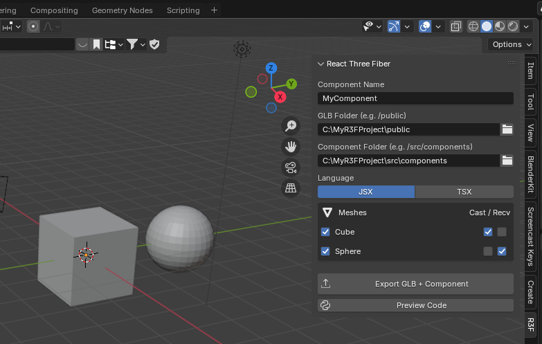

<div align="center">

# 🧊 BR3F — Blender → React Three Fiber

**Export your Blender scene to a `.glb` _plus_ a ready-to-use
[React Three Fiber](https://github.com/pmndrs/react-three-fiber) component —
in one click, from inside Blender.**

[](https://www.blender.org/)
[](https://github.com/pmndrs/react-three-fiber)
[](#license)
[](BR3F.py)



</div>

```
Blender scene  ──►  public/myScene.glb  +  src/components/MyScene.tsx (or .jsx)
```

The whole addon is a single Python file: [`BR3F.py`](BR3F.py).
No Node.js, no CLI, no dependencies.

## Why

Getting a Blender model into an R3F project normally takes two tools: export
a GLB from Blender, then run `gltfjsx` (or paste the file into a web
converter) to generate the component. When you're iterating on lots of
models, that round trip adds up fast — every scene tweak means exporting
*and* converting again, and the GLB and component quietly drift out of sync.

BR3F does both steps natively in Blender. Tweak your scene, click **Export
GLB + Component**, refresh your app. You can even set per-mesh preferences
for the output, like adding `castShadow` or `receiveShadow` to individual
meshes.

## Install

1. Download [`BR3F.py`](BR3F.py).
2. In Blender: **Edit → Preferences → Add-ons → Install…** and pick the file.
3. Enable **BR3F — Blender React Three Fiber** in the addon list.

Works in Blender 3.6+.

## Use

1. Press `N` in the 3D viewport and open the **BR3F** tab.
2. Set the **Component Name** (e.g. `MyScene`).
3. Point **GLB Folder** at your app's `public/` directory and
   **Component Folder** at `src/components/` (leave the component folder
   empty to write both files side by side).
4. Pick **JSX** or **TSX**.
5. In the **Meshes** list, tick which meshes to include and toggle their
   `castShadow` / `receiveShadow` props individually.
6. Click **Export GLB + Component**.

Then use it like any other component:

```tsx
import { MyScene } from './components/MyScene'

<Canvas>
  <MyScene position={[0, 0, 0]} />
</Canvas>
```

The generated component loads the model with drei's `useGLTF` from
`/<name>.glb` — which works out of the box with Vite, Next.js and CRA, since
they all serve the `public/` folder at the web root.

> 💡 **Tip:** hit **Preview Code** first to see exactly what BR3F will
> generate — no files written until you're happy.

## Features

- **Per-mesh control** — the panel lists every mesh in the scene with
  checkboxes to include/exclude it from the export and to toggle its
  `castShadow` / `receiveShadow` props individually.
- **JSX or TSX** — TypeScript output includes a typed `GLTFResult` built
  from the exact nodes and materials the component references.
- **Preview Code** — opens the generated component in a new window before
  you write anything to your project.
- **Faithful output** — node keys match what three.js `GLTFLoader` produces
  at runtime (name sanitization and deduplication), rotations are converted
  from quaternions to Euler angles, identity transforms are omitted, and
  multi-material meshes expand into a group the same way the loader builds
  them.
- **Settings stick** — export options are stored in the `.blend` file;
  per-mesh flags are stored on the objects themselves.

## Contributing

Bug reports, ideas and pull requests are welcome — see
[CONTRIBUTING.md](CONTRIBUTING.md).

## License

GPL-3.0-or-later (as required for Blender addons).

Generated components include a short attribution comment — please keep it
intact.

---

<div align="center">

### ⭐ If BR3F saved you some clicks, please star the repo and share it!

It genuinely helps other Blender + R3F devs find the project.

</div>
