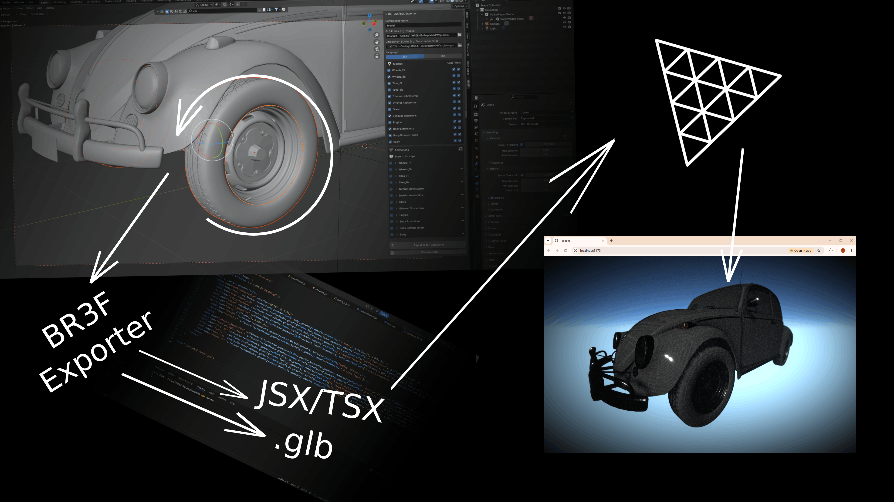

<div align="center">

# 🧊 BR3F — Blender → React Three Fiber

**Export your Blender scene to a `.glb` _plus_ a ready-to-use
[React Three Fiber](https://github.com/pmndrs/react-three-fiber) component —
in one click, from inside Blender.**

## Try now at extensions.blender.org:
[extensions.blender.org - BR3F](https://extensions.blender.org/add-ons/br3f/)

---

[](https://www.blender.org/)
[](https://github.com/pmndrs/react-three-fiber)
[](#license)
[](BR3F.py)




</div>

```
Blender scene  ──►  public/myScene.glb  +  src/components/MyScene.tsx (or .jsx)
```

The add-on's logic is a single Python file: [`BR3F.py`](BR3F.py) — no Node.js,
no CLI, no dependencies. (A small [`blender_manifest.toml`](blender_manifest.toml)
and a one-line `__init__.py` wrap it for the Blender 4.2+ Extensions platform.)

## Why

Getting a Blender model into an R3F project normally takes two tools: export
a GLB from Blender, then run `gltfjsx` (or paste the file into a web
converter) to generate the component. When you're iterating on lots of
models, that round trip adds up fast — every scene tweak means exporting
*and* converting again, and the GLB and component quietly drift out of sync.

BR3F does both steps natively in Blender. Tweak your scene, click **Export
GLB + Component**, refresh your app. You can also set per-mesh preferences for
the output — `castShadow` / `receiveShadow` on individual meshes — and pick
which animation clips ship, renaming them on the way out.

## Install

> **BR3F** is the project name; in Blender the add-on installs as
> **R3F JSX/TSX Exporter** and adds a **BR3F** tab to the 3D viewport sidebar.

### Blender 4.2+ (extension)

1. Download the latest `br3f-x.y.z.zip` from the [Releases](../../releases)
   page (or build it yourself — see
   [CONTRIBUTING.md](CONTRIBUTING.md#releasing)).
2. Drag the `.zip` into Blender, or go to **Edit → Preferences → Add-ons → ⌄ →
   Install from Disk…** and pick it.
3. Enable **R3F JSX/TSX Exporter** in the add-on list.

### Blender 3.6–4.1 (legacy single file)

1. Download [`BR3F.py`](BR3F.py).
2. In Blender: **Edit → Preferences → Add-ons → Install…** and pick the file.
3. Enable **R3F JSX/TSX Exporter** in the add-on list.

## Use

1. Press `N` in the 3D viewport and open the **BR3F** tab.
2. Set the **Component Name** (e.g. `MyScene`).
3. Point **GLB Folder** at your app's `public/` directory and
   **Component Folder** at `src/components/` (leave the component folder
   empty to write both files side by side).
4. Pick **JSX** or **TSX**.
5. In the **Meshes** list, tick which meshes to include and toggle their
   `castShadow` / `receiveShadow` props individually.
6. Animated scene? See [Animations](#animations) just below.
7. Click **Export GLB + Component**.

Then use it like any other component:

```tsx
import { MyScene } from './components/MyScene'

<Canvas>
  <MyScene position={[0, 0, 0]} />
</Canvas>
```

The generated component loads the model with drei's `useGLTF` from
`/<name>.glb` — which works out of the box with Vite, Next.js and CRA, since
they all serve the `public/` folder at the web root.

> 💡 **Tip:** hit **Preview Code** first to see exactly what BR3F will
> generate — no files written until you're happy.

## Animations

The **Animations** box lists every mesh and armature in the scene, with the
clips that drive it tucked underneath:

```
Animations                              ⟳
[x] ▾ Armature                          3
      [x] Idle
      [x] Walk
      [ ] TPose        ← unticked, so it won't be exported
[ ] ▸ Cube                              —
      ↑ greyed out: nothing animates this object
```

1. **Hit ⟳ once to scan.** BR3F runs a throwaway export to find out which
   clips your scene actually produces, then files each one under the object it
   drives. (Every **Export** and **Preview** refreshes the list too, so you
   normally only press this at the start.)
2. **Untick what you don't want.** The object-level checkbox is a master
   switch for all its clips.
3. **Rename freely.** Type over a clip name and that's the name it gets in the
   `.glb` — which is the key you look it up by: `Walk` → `actions.Walk`.
4. **Export.**

Rigged characters work too. BR3F emits `<skinnedMesh>` with its `skeleton`,
and mounts the armature's root bone as `<primitive object={nodes.Hips} />` —
that's what makes skeletal animation actually play rather than load silently.

> **Why scan at all?** Blender's glTF exporter names clips differently between
> versions and depending on whether the action lives in an NLA track. Rather
> than guess, BR3F reads the names back out of a real export — so what the
> panel shows is exactly what lands in the file.

### What you get

Export an animated scene and the component arrives wired up, with a worked
example you can keep or delete:

```jsx
import { LoopOnce } from 'three'
import React, { useRef } from 'react'
import { useAnimations, useGLTF } from '@react-three/drei'

export function MyScene(props) {
  const group = useRef()
  const { nodes, materials, animations } = useGLTF('/myScene.glb')
  const { actions } = useAnimations(animations, group)

  // Play a clip once, holding its last frame when it finishes.
  const playOnce = (name) => {
    const action = actions[name]
    if (!action) return
    action.reset()
    action.setLoop(LoopOnce, 1)
    action.clampWhenFinished = true
    action.play()
  }

  /* Driving the animations
   *   ...a short explainer, plus "You could also try these!" listing
   *   your other clips so you know what's in there.
   */
  return (
    <group ref={group} {...props} dispose={null}>
      <mesh name="Cube" onClick={() => playOnce('Idle')} ... />
    </group>
  )
}
```

The `onClick` lands on the first group or mesh only — click your model in the
browser and a clip runs, so you know it works within seconds of exporting.
Delete that one prop and call `playOnce` from wherever suits you: a
`useEffect` on mount, a keypress, a button outside the `<Canvas>`.

TSX output additionally narrows the clip names, so `actions.Idle` type-checks
and typos don't:

```ts
type ActionName = 'Idle' | 'Walk' | 'TPose'
```

> 💡 **`console.log(actions)` prints `{}` — that's normal.** drei defines each
> key as a lazy getter, so devtools won't evaluate them, and they return
> `undefined` until the root ref is attached. `actions.Idle` inside an effect
> or a handler works fine; `names` gives you the plain list.

## Features

- **Per-mesh control** — the panel lists every mesh in the scene with
  checkboxes to include/exclude it from the export and to toggle its
  `castShadow` / `receiveShadow` props individually.
- **[Animations](#animations)** — pick which clips ship, rename them, and get
  drei's `useAnimations` wired up for you, with a click-to-play example to
  prove it works. Rigged models get `<skinnedMesh>` and their bones.
- **JSX or TSX** — TypeScript output includes a typed `GLTFResult` built
  from the exact nodes and materials the component references.
- **Preview Code** — opens the generated component in a new window before
  you write anything to your project.
- **Faithful output** — node keys match what three.js `GLTFLoader` produces
  at runtime (name sanitization and deduplication), every mesh carries the
  `name` its animation tracks address it by, rotations are converted
  from quaternions to Euler angles, identity transforms are omitted, and
  multi-material meshes expand into a group the same way the loader builds
  them.
- **Settings stick** — export options and the clip list are stored in the
  `.blend` file; per-object flags are stored on the objects themselves, so
  they travel with an appended or linked model.

## Roadmap

Where BR3F might go next — ideas, not promises, and **all open to
contribution**. 🌱 marks the ones that are a good first change: small,
self-contained, and testable without leaving your terminal. Want to pick one
up, or got a use case that isn't here? [Open an issue](../../issues).

**v0.2 — closing the obvious gaps**

- [x] Export animations and wire up drei's `useAnimations`
- [ ] Scope the export to a chosen collection or the current selection
- [ ] Draco compression toggle for smaller `.glb` files 🌱

**v0.3 — nice-to-haves**

- [ ] Instancing / merging for repeated meshes (`<Instances>` / `<Merged>`)
- [ ] Emit cameras and lights instead of skipping them 🌱
- [ ] Copy-to-clipboard in the Preview window 🌱

**v1.0 — platform & polish**

- [x] Blender 4.2+ extension manifest (`blender_manifest.toml`) for the
      Extensions platform
- [ ] Publish BR3F on [extensions.blender.org](https://extensions.blender.org)
- [ ] Shape keys / morph target support

**Project plumbing**

- [ ] CI that runs `_smoke_test.py` on every pull request

## Contributing

**You don't need Blender to help.** All the interesting logic — reading the
GLB, generating the JSX — is plain Python with no `bpy` dependency, and
there's a test that runs it in one command:

```bash
python _smoke_test.py
```

That prints a complete generated component to your terminal. Edit the
generator, run it again, read the difference. That's the whole loop, and it
takes about a second.

Everything else — where each piece lives, what to touch, how to test the
Blender side when you do need it — is in
[CONTRIBUTING.md](CONTRIBUTING.md). Bug reports and ideas are just as welcome
as code; [open an issue](../../issues) and say hello.

## License

GPL-3.0-or-later (as required for Blender addons).

Generated components no longer include a short attribution comment - Blender Addons wouldn't allow it :(.
intact.

---

<div align="center">

### ⭐ If BR3F saved you some clicks, please star the repo and share it!

It genuinely helps other Blender + R3F devs find the project.

</div>
