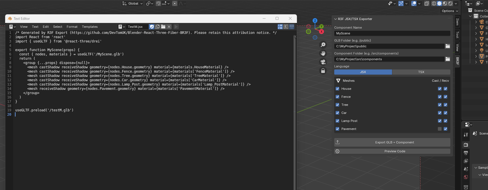

<div align="center">

# 🧊 BR3F — Blender → React Three Fiber

**Export your Blender scene to a `.glb` _plus_ a ready-to-use
[React Three Fiber](https://github.com/pmndrs/react-three-fiber) component —
in one click, from inside Blender.**

## Try now at extensions.blender.org:
[extensions.blender.org - BR3F](https://extensions.blender.org/add-ons/br3f/)

---

[](https://www.blender.org/)
[](https://github.com/pmndrs/react-three-fiber)
[](#license)
[](BR3F.py)



</div>

```
Blender scene  ──►  public/myScene.glb  +  src/components/MyScene.tsx (or .jsx)
```

The add-on's logic is a single Python file: [`BR3F.py`](BR3F.py) — no Node.js,
no CLI, no dependencies. (A small [`blender_manifest.toml`](blender_manifest.toml)
and a one-line `__init__.py` wrap it for the Blender 4.2+ Extensions platform.)

## Why

Getting a Blender model into an R3F project normally takes two tools: export
a GLB from Blender, then run `gltfjsx` (or paste the file into a web
converter) to generate the component. When you're iterating on lots of
models, that round trip adds up fast — every scene tweak means exporting
*and* converting again, and the GLB and component quietly drift out of sync.

BR3F does both steps natively in Blender. Tweak your scene, click **Export
GLB + Component**, refresh your app. You can even set per-mesh preferences
for the output, like adding `castShadow` or `receiveShadow` to individual
meshes.

## Install

> **BR3F** is the project name; in Blender the add-on installs as
> **R3F JSX/TSX Exporter** and adds a **BR3F** tab to the 3D viewport sidebar.

### Blender 4.2+ (extension)

1. Download the latest `br3f-x.y.z.zip` from the [Releases](../../releases)
   page (or build it yourself — see
   [CONTRIBUTING.md](CONTRIBUTING.md#releasing)).
2. Drag the `.zip` into Blender, or go to **Edit → Preferences → Add-ons → ⌄ →
   Install from Disk…** and pick it.
3. Enable **R3F JSX/TSX Exporter** in the add-on list.

### Blender 3.6–4.1 (legacy single file)

1. Download [`BR3F.py`](BR3F.py).
2. In Blender: **Edit → Preferences → Add-ons → Install…** and pick the file.
3. Enable **R3F JSX/TSX Exporter** in the add-on list.

## Use

1. Press `N` in the 3D viewport and open the **BR3F** tab.
2. Set the **Component Name** (e.g. `MyScene`).
3. Point **GLB Folder** at your app's `public/` directory and
   **Component Folder** at `src/components/` (leave the component folder
   empty to write both files side by side).
4. Pick **JSX** or **TSX**.
5. In the **Meshes** list, tick which meshes to include and toggle their
   `castShadow` / `receiveShadow` props individually.
6. If your scene is animated, hit the ⟳ button in the **Animations** box to
   list the clips, then tick the ones you want and rename them if you like.
7. Click **Export GLB + Component**.

Then use it like any other component:

```tsx
import { MyScene } from './components/MyScene'

<Canvas>
  <MyScene position={[0, 0, 0]} />
</Canvas>
```

The generated component loads the model with drei's `useGLTF` from
`/<name>.glb` — which works out of the box with Vite, Next.js and CRA, since
they all serve the `public/` folder at the web root.

When the export includes animations, the component also gets drei's
`useAnimations` — plus a worked example you can keep or throw away. BR3F
writes a `playOnce` helper, an `onClick` on the first mesh so you can click
the model and watch a clip run, and a comment block explaining how to drive
it yourself:

```jsx
// Play a clip once, holding its last frame when it finishes.
const playOnce = (name) => {
  const action = actions[name]
  if (!action) return
  action.reset()
  action.setLoop(LoopOnce, 1)
  action.clampWhenFinished = true
  action.play()
}
```

> 💡 `console.log(actions)` prints `{}` — that's normal. drei defines each key
> as a lazy getter, so devtools won't evaluate them, and they stay `undefined`
> until the root ref is attached. `actions.Idle` inside an effect or a handler
> works fine; `names` gives you the list.

> 💡 **Tip:** hit **Preview Code** first to see exactly what BR3F will
> generate — no files written until you're happy.

## Features

- **Per-mesh control** — the panel lists every mesh in the scene with
  checkboxes to include/exclude it from the export and to toggle its
  `castShadow` / `receiveShadow` props individually.
- **Animations** — the **Animations** box lists every mesh and armature with a
  checkbox that's greyed out when nothing animates it. Expand a row to see its
  clips, tick the ones you want, and rename any of them — the name you type is
  the key you look up in `actions`. Animated components are generated with
  drei's `useAnimations` wired to a ref on the root group, a ready-to-run
  `playOnce` example, and — for rigged models — `<skinnedMesh>` +
  `<primitive object={nodes.Bone} />` so skeletal animation actually plays.
- **JSX or TSX** — TypeScript output includes a typed `GLTFResult` built
  from the exact nodes and materials the component references.
- **Preview Code** — opens the generated component in a new window before
  you write anything to your project.
- **Faithful output** — node keys match what three.js `GLTFLoader` produces
  at runtime (name sanitization and deduplication), rotations are converted
  from quaternions to Euler angles, identity transforms are omitted, and
  multi-material meshes expand into a group the same way the loader builds
  them.
- **Settings stick** — export options are stored in the `.blend` file;
  per-mesh flags are stored on the objects themselves.

## Roadmap

Where BR3F might go next — ideas, not promises, and all open to contribution.
Got a use case or want to pick one up? [Open an issue](../../issues).

**v0.2 — closing the obvious gaps**

- [x] Export animations and wire up drei's `useAnimations`
- [ ] Scope the export to a chosen collection or the current selection
- [ ] Draco compression toggle for smaller `.glb` files

**v0.3 — nice-to-haves**

- [ ] Instancing / merging for repeated meshes (`<Instances>` / `<Merged>`)
- [ ] Emit cameras and lights instead of skipping them
- [ ] Copy-to-clipboard in the Preview window

**v1.0 — platform & polish**

- [x] Blender 4.2+ extension manifest (`blender_manifest.toml`) for the
      Extensions platform
- [ ] Publish BR3F on [extensions.blender.org](https://extensions.blender.org)
- [ ] Shape keys / morph target support

**Project plumbing**

- [ ] CI that runs `_smoke_test.py` on every pull request

## Contributing

Bug reports, ideas and pull requests are welcome — see
[CONTRIBUTING.md](CONTRIBUTING.md).

## License

GPL-3.0-or-later (as required for Blender addons).

Generated components no longer include a short attribution comment - Blender Addons wouldn't allow it :(.
intact.

---

<div align="center">

### ⭐ If BR3F saved you some clicks, please star the repo and share it!

It genuinely helps other Blender + R3F devs find the project.

</div>
